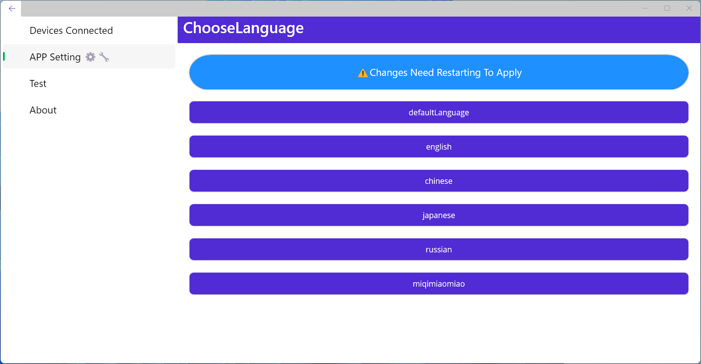

> Made by `MAUI` with VS2022
# Example

---

# Advantage

> crossplatform

# Structure

> `Assets.cs`
> >Store variable

>`Utilities.cs`
>>store tools with multiple aspects including Files,GUI,Transform